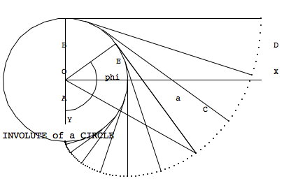

involute -- Involute of a Circle
---------------------------------

Analysis
~~~~~~~~~~~

Here's what **may** be the diagram from HamCalc.

The subtlety is that HamCalc includes an aspect ratio
correction for the graphics.

The locations of the label for vertex C and angle a appear
to be misplaced. Also the angle phi isn't perfectly clear
from the diagram.

It seems to match the standard definition of an involute.

The program asks for "Radius OE", :math:`\overline{OE}`, and computes

-   "Diameter AB"

    ..  math::

        \overline{AB} = 2 \times \overline{OE}

-   "Base Line BD"

    ..  math::

        \overline{BD} = \pi \times \overline{OE}

-   "Involute ACD"

    ..  math::

        \frac{\pi^2}{2} \overline{OE}

It then asks for angle "phi" and computes "Values for point C".

It produces X and Y coordinate for point C.

..  math::

    X = \overline{OE}(\sin \phi - \phi \cos \phi)

    Y = \overline{OE}(\cos \phi - \phi \sin \phi)

It produces angle a, also knows as OCE

..  math::

    \overline{CO} = \sqrt{x^2+y^2}

    \overline{CE} = \sqrt{\overline{CO}^2-\overline{OE}^2}

    a = \angle OCE = \arctan \frac{\overline{OE}}{\overline{CE}}

It produced angle COE (:math:`\angle COE = 90-a`) and the lengths line CO and CE.

Implementation
~~~~~~~~~~~~~~~

Involute uses R and Phi to compute a number of values.

..  automodule:: hamcalc.math.involute
    :members:

Quirks
~~~~~~~~~~

Lines 880-900 cannot be executed.

