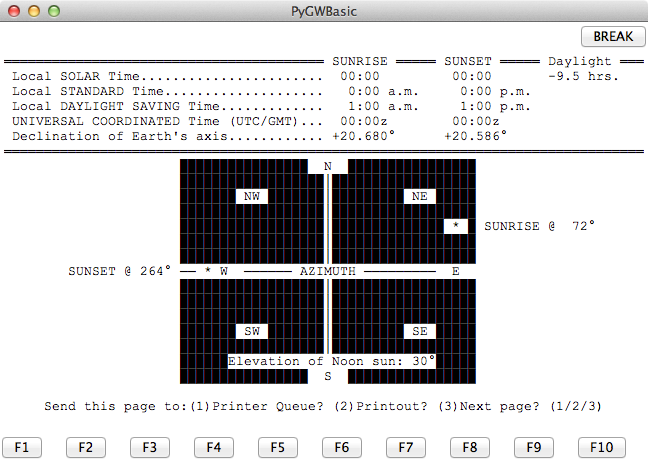

riseset -- Sunrise/Sunset Calculator
--------------------------------------

Analysis
~~~~~~~~~~~

This has a "sub-menu" that includes

-   :program:`daydusk`, Daylight, Dusk and Dawn Calculator
-   :program:`sunup`, Sunup/Sundown calendar
-   :program:`seasons`, Equinoxes/Solstices program
-   :program:`latlong`, LATITUDE/LONGITUDE DATA BASE

This is essentially the same calculations in :program:`sunup`, :program:`seasons`, and :program:`daydusk`.

This calculates a number of details
about sunrise and sunset on a given date.

-   Local Solar Time of Sunrise and Sunset.

-   Local Standard Time or Sunrise and Sunset.
    [This assumes a simple 15°/hour UTC offset, which may not be true.]

-   Local Daylight Time of Sunrise and Sunset.

-   UTC of Sunrise and Sunset.

-   Declination of the Earth's Axis at of Sunrise and Sunset.
    [This might be a misuse of this term.
    Usually things in the sky have their positions described
    by declination and right ascension, the axial tilt
    at a given time may actually be the "Ecliptic Obliquity."]

-   Azimuth of Sunrise and Sunset.

Two additional things:

-   Altitude at transit of the meridian.

-   Hours of daylight.

This is accompanied by an ASCII-art "radar" chart of the sun's positions.

Implementation
~~~~~~~~~~~~~~~~~~~~~

This information may all be available in the :mod:`hamcalc.navigation.solar`
module.  See :ref:`navigation.sunup`.

Legacy Introduction
~~~~~~~~~~~~~~~~~~~~~

::

    SUNRISE / SUNSET                                        by George Murphy VE3ERP

      This program calculates sunrise and sunset times anywhere on earth
      by entering the latitude and longitude of the desired location.

      Related data can also be calculated using Hamcalc's `Daylight, Dusk
      and Dawn Calculator' program.

Legacy Output
~~~~~~~~~~~~~~~~~

Here's a kind of screen grab. The calculation results aren't
correct. But the layout is pretty close.

Legacy Quirks
~~~~~~~~~~~~~~~

The Standard Time/Daylight Time is based on numerous assumptions,
some of which can be false.

They seem to be based on the idea that the legacy computer systems
where not timezone aware, making the assumptions useful.
